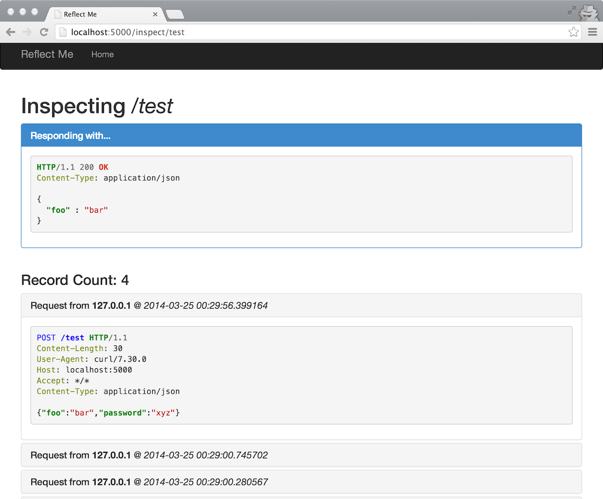

reflectme
=========

Simple HTTP server for recording requests and returning arbitrary responses.

Installation
------------

```sh
$ python setup.py install
```

Usage
-----

```sh
$ reflectme 0.0.0.0 8080
```

Open `http://localhost:8080` and create a new path (`test` below)

```sh
$ curl http://localhost:8080/test -i --data "foo=bar"
```

Refresh the inspection page to view your results.

```
usage: reflectme [-h] [--database DATABASE] [--debug] [--reset] [host] [port]

Create an HTTP server to record and respond to requests.

positional arguments:
  host                 host to listen on (default: 0.0.0.0)
  port                 host to listen on (default: 5000)

optional arguments:
  -h, --help           show this help message and exit
  --database DATABASE  sqlite database location (default:
                       /Users/chuck/Library/Application
                       Support/reflectme/database.db)
  --debug              run web server in debug mode
  --reset              reset database (clear all records)
```

Screenshot
----------



